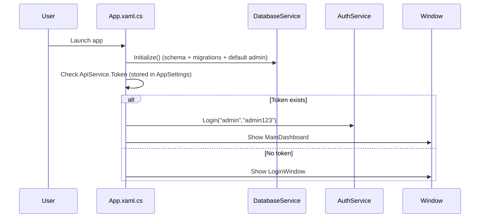
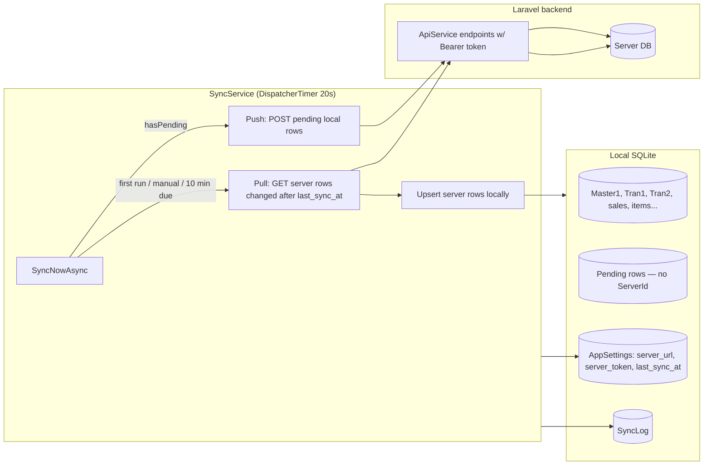
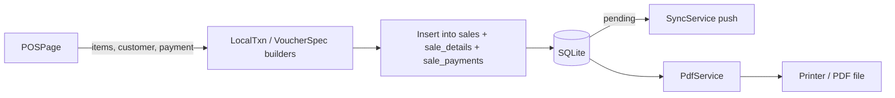
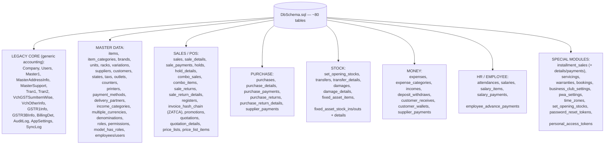

# RashanKiDukan — Project Architecture (for AI models)

WPF (C#, .NET 8) offline-first grocery/wholesale billing desktop app.
Local SQLite database + two-way sync with a Laravel (Sanctum) REST backend.

---

## 1. High-Level Architecture

```mermaid
flowchart TB
    subgraph UI["UI Layer (WPF) — Views/"]
        LOGIN[LoginWindow]
        DASH[MainDashboard]
        POS[POSPage]
        INV[InvoicesPage / Invoice creation]
        PUR[Purchases / Purchase Returns]
        STOCK[StockPage / InventoryPage]
        CST[Clients: Customers / Suppliers]
        PAY[Payments / Banking / GST / Reports]
        CFG[Config pages: EntityCrudPage + EntityRegistry]
        OTH[Expenses / Marketing / BusinessClub / Calculator...]
    end

    subgraph APP["App Shell"]
        APPSTART["App.xaml.cs — startup: DB init -> Auth -> Dashboard"]
        AUTH[AuthService — BCrypt login vs local users table]
    end

    subgraph SVC["Services Layer — Services/"]
        API[ApiService — HttpClient REST client for Laravel API]
        SYNC[SyncService — 2-way sync engine (20s timer)]
        PDF[PdfService — QuestPDF invoice/print generation]
    end

    subgraph DB["Data Layer — Database/"]
        DBCORE[DatabaseService — SQLite at %LOCALAPPDATA%\\RashanKiDukan\\data.db]
        SCHEMA[DbSchema.sql (embedded resource) + Migrate()]
        LOOKUP[Lookups — dropdown query helpers]
    end

    subgraph SERVER["Backend (external)"]
        LARAVEL[Laravel API + Sanctum tokens]
        REMOTEDB[(MySQL backend DB)]
    end

    LOGIN --> AUTH
    AUTH --> DASH
    DASH --> POS & INV & PUR & STOCK & CST & PAY & CFG & OTH
    POS --> SVC
    INV --> SVC
    PUR --> SVC
    STOCK --> SVC
    CFG --> DBCORE
    SVC --> DBCORE
    DBCORE --> SCHEMA
    API --> LARAVEL
    LARAVEL --> REMOTEDB
    SYNC --> API
    SYNC --> DBCORE
    PDF --> DBCORE
```

---

## 2. Startup Flow



---

## 3. Offline-First Sync Engine (SyncService)



Key facts:
- `SyncService.cs` (~2,169 lines) is the biggest service: push pending local rows, pull server changes, auto-sync every 20 seconds, manual Resync.
- Server connection config stored in SQLite `AppSettings` table (keys: `server_url`, `server_email`, `server_password`, `server_token`, `last_sync_at`).
- Sync columns (`ServerId`, etc.) are added lazily by `DatabaseService.Migrate()` via `AddColumnIfMissing`.

---

## 4. Data-Flow Through the App (Billing example)



Same pattern for: purchases, purchase returns, sale returns, holds (hold vouchers), transfers, damages, expenses, payments, quotations.

---

## 5. Module Map (folder -> responsibility -> key files)

```mermaid
flowchart TD
    ROOT["RashanKiDukan.csproj — net8.0-windows, WPF"]
    ROOT --> MOD[Models/User.cs — only model class]
    ROOT --> DB
    ROOT --> SVC
    ROOT --> VW
    ROOT --> ASM[Assets/logo.png]

    DB["Database/"]
    DB --> DBS[DatabaseService.cs — SQLite conn, schema init, migrations, CRUD helpers]
    DB --> LK[Lookups.cs — reusable dropdown SQL]
    DB --> SCH[DbSchema.sql — full schema (embedded + copied to output)]

    SVC["Services/"]
    SVC --> API[ApiService.cs — REST client, token mgmt, endpoints]
    SVC --> AUTH[AuthService.cs — local login (BCrypt)]
    SVC --> SYNC[SyncService.cs — 2-way offline sync]
    SVC --> PDF[PdfService.cs — QuestPDF invoice printing]

    VW["Views/ — ~75 WPF pages"]
    VW --> NAV[Navigation: MainDashboard hosts all pages]
    VW --> GENERIC[Generic pages: EntityCrudPage + EntityRegistry.cs specs]
    VW --> GENERIC2[LineItemVoucherPage + VoucherSpec.cs for voucher docs]
    VW --> BUSINESS[Business pages: POS, invoices, purchases, stock, payments, reports, GST, expenses, marketing, business club, calculator...]
    VW --> HELPERS[Helpers: PrintInvoiceHelper, LocalTxn, ConfigEntityInfo, dialogs/windows]
```

---

## 6. Database Table Groups



Naming conventions: header tables (`sales`, `purchases`, `damages`) + detail tables (`sale_details`, `purchase_details`, `damage_details`) + payment tables (`sale_payments`, `purchase_payments`). Every table carries `user_id`, `company_id`, `outlet_id`, `del_status` ('Live'/'Delete') for multi-tenant soft-delete.

---

## 7. Config-Driven CRUD (EntityRegistry pattern)

`EntityRegistry.cs` defines ~30 `CrudSpec` entities (outlets, printers, counters, income, attendance, salary, promotions, warranties, servicings, installment sales, fixed assets, transfers, damages, quotations...). Each spec: table name, list columns, field definitions (text/number/date/combo/comboSql/check), reference number prefix (OUT, INC, REC, ADV, SAL, TRN, DMG, QTN, SRET, WAR, SER, INS, FAIN, FAOUT).

```mermaid
flowchart LR
    REG[EntityRegistry.CrudSpec] --> CRUD[EntityCrudPage — generic list+form]
    CRUD --> SQLR[Raw SQL SELECT/INSERT/UPDATE/DELETE]
    SQLR --> SQLITE[(SQLite)]
    CRUD --> VCH2[LineItemVoucherPage — voucher w/ line items (VoucherSpec)]
    VCH2 --> SQLR
```

This means most "small" modules (income, attendance, transfers, etc.) share ONE generic CRUD page driven by spec metadata — no per-entity code needed.

---

## 8. Quick Facts / Conventions

- `RashanKiDukan.csproj`: `net8.0-windows`, WPF, `Nullable=disable`, `ImplicitUsings=enable`. Packages: `BCrypt.Net-Next`, `Microsoft.Data.Sqlite` 8.0, `QuestPDF`.
- No MVVM framework, no ORM — code-behind + raw ADO.NET (Microsoft.Data.Sqlite) everywhere.
- Local DB path: `%LOCALAPPDATA%\RashanKiDukan\data.db` (created at runtime).
- Backend: Laravel API with Sanctum Bearer tokens; `ApiService` handles auth/login and CRUD endpoints.
- Global exception handler in `App.xaml.cs` shows MessageBox.
- `publish/` folder exists — single-file publish used.
- Main entry: `App.xaml.cs` -> `MainWindow.xaml.cs` (main window shell) -> `MainDashboard.xaml.cs` (navigation host).
